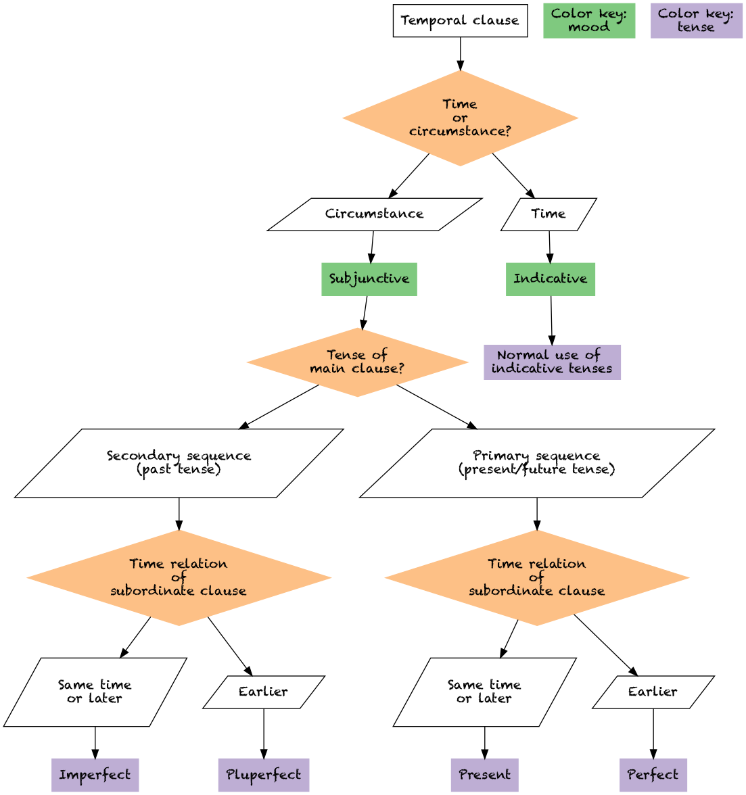

# Latin 102-04: home page

> In Latin 102, you encounter a historical language and culture, and engage with how that language and culture continue to shape structures of power today.

Zoom for [class meetings MWF 9:15-10:05](https://holycross.zoom.us/j/96104492045?pwd=eEtBL1FkUnJZcURCeE9ETmxtMk9lUT09)

## Announcements
 
 - **Feb 10**: change to class plans: Friday class now optional workshop sessions.  See updated assignment with [required and optional work](../assignments/future/)
 - **Feb 10**: *new section* in course web site:  materials to [help you review](../review/)
- **Feb 9**: [week 2 drills](./checklist/drills/week2/) for future tense forms available
- **Feb. 8**:  [flow chart](./imgs/sot.png) for determining tense and mood in temporal clauses  
- [earlier announcements](./oldnews/)
- [notes from breakout sessions](./breakouts/)

## This week in summary

Feb. 8-12:

- **Main language features**: class assignments review common pronouns and continue to review verb forms and constructions. New: fifth declension nouns; future indicative tense.
- **Vocabulary**: learn (very short!) [week 2 vocabulary list](./vocabulary/week2/)
- **Exercises**: [drill verb forms; drill nouns and pronouns](./checklist/drills/week2/).
- **Due dates this week**:  [translation 1](./checklist/translation1/) due Friday

