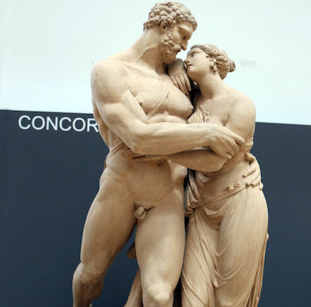

# Agenda:

- a Latin idiom
- review indirect statement
- review reflexive pronoun
- form the future participle

---

`(Hercules and Deianira. 1801. Pietro Finelli. terracotta)`

# A Latin idiom

With a male subject and female direct object:

> **ducere in coniugium**

or 

> **ducere uxorem**

---

# Active voice

(Today) Hercules is marrying Deianira.

> Hercules Deianiram in coniugium **ducit**.

(Tomorrow) Hercules will marry Deianira.

> Hercules Deianiram in coniugium **ducet**.

(Yesterday) Hercules married Deianira.

> Hercules Deianiram in coniugium **duxit**.

---

# Passive voice

(Today) Deianira is wed by Hercules.

>  Deianira ab Hercule in coniugium **ducitur**.

(Tomorrow) Deianira will be wed by Hercules.

> Deianira ab Hercule in coniugium **ducetur**.

(Yesterday) Deianira was wed by Hercules.

> Deianira ab Hercule in coniugium **ducta est**.

---

# Indirect statement

- verb in infinitive
- subject of verb in accusative
- tense:
    - same time as main verb: present
    - before main verb: perfect
    - after main verb: future

---

# Hyginus writes/**Hyginus scribit**

...that Hercules is marrying Deianira.

> Herculem Deianiram in coniugium **ducere**.

...that Hercules married Deianira.

> Herculem Deianiram in coniugium **duxisse**.

---

# Hyginus writes/**Hyginus scribit**

...that Deianira is wed by Hercules.

>  Deianiram ab Hercule in coniugium **duci**.

...that Deianira was wed by Hercules.

> Deianiram ab Hercule in coniugium **ductam esse**.

---

# Future active infinitive

- like the perfect passive, an adjective + *esse*
- (weirdly) uses the *fourth* principal part
- extends with -**ur**- and **us/a/um** endings

Example:

> duco, ducĕre, duxi, ductus
> duct+ur+ending -> **ducturum/ducturam/ducturum esse**

---

# Hyginus writes/**Hyginus scribit**

...that Hercules will marry Deianira.

> Herculem Deianiram in coniugium **ducturum esse**.

---

# Pronouns and family roles

He (Eurytus) promised that he (the centaur) would marry Iole.

> pollicitus est **eum** Iolen in coniugium **ducturum esse**.

He (Eurytus) promised that he (Eurytus) would give away Iole in marriage.

> pollicitus est **se** Iolen in coniugium **daturum esse**.

---
