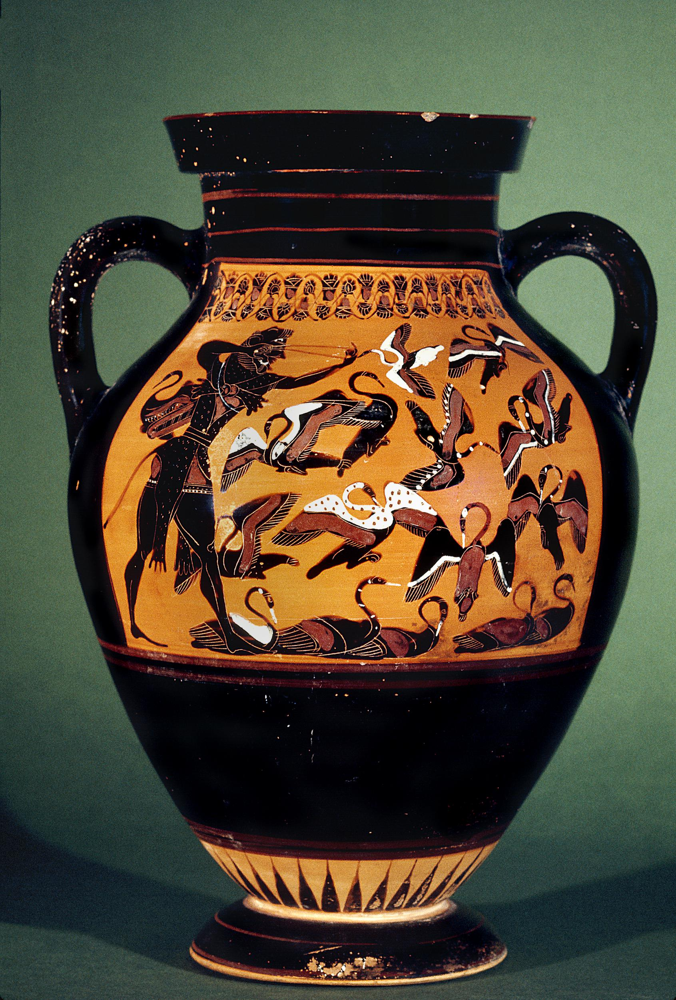

# Hyginus, chapter 30, sections 4-6

| | |
| --- | ---  | 
|   | `4` aprum Erymanthium occidit. |
|  | `5` ceruum ferocem in Arcadia cum cornibus aureis uiuum in conspectu Eurysthei regis adduxit. |
|   | `6` aues Stymphalides in insula Martis, quae emissis pennis suis iaculabantur, sagittis interfecit. |

