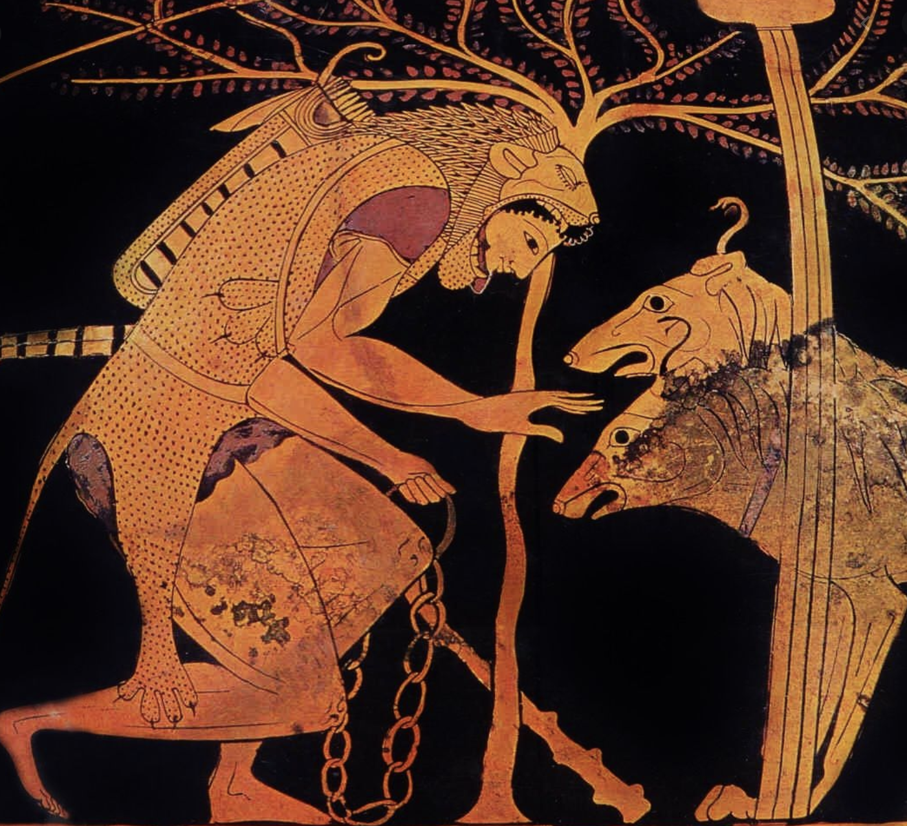

# The gerundive: an adjective made from a verb

---

# Form

> Example: *laudo, laudāre -> laudandus, -a, -um*

1. same stem as imperfect
2. plus *nd*
3. regular 2-1-2 adjective endings *-us, -a, -um*

Like all adjectives, agrees with noun in **gender, case** and **number**

---

# Review: imperfect stem

**1st.** laudo, laudāre -> lauda- *+ ba*

**2nd.** video, vidēre -> vide- *+ ba*

**3rd.** duco, ducere -> duce- *+ ba*

**3rd-io.** capio, capere -> capie- *+ ba*

**4th.** audio, audire -> audie- *+ ba*

---

# Gerundive

**1st.** laudo, laudāre -> lauda-*nd*-us, -a, -um

**2nd.** video, vidēre -> vide-*nd*-us, -a, -um

**3rd.** duco, ducere -> duce-*nd*-us, -a, -um

**3rd-io.** capio, capere -> capie-*nd*-us, -a, -um

**4th.** audio, audire -> audie-*nd*-us, -a, -um

----

# Meaning

- *passive* voice
- idea of necessity

---

# Modifying a noun

*vir* ***laudandus***

> A man **who must be praised**
>
> A **praiseworthy** man

---

# A predicate adjective

## Carthago delenda est.

>  • Cato the Elder

Vocabulary:

- *Carthago, Carthaginis*, feminine - "Carthage"
- *deleo, delēre, delevi, deleteus* - "to destroy"

---

## Carthago **delenda** est.

> Carthage **must be destroyed**!

*or*

> We **must destroy** Carthage!

---

# Expressing purpose

`79a` Hercules ad *canem tricipitem* **ducendum** venit.

> "Hercules came to *the three-headed dog* **who must be fetched**."

---

# Prefer the active voice in English

*The three-headed dog* **was fetched** by Hercules.

Hercules **fetched** *the three-headed dog*.

---

# Expressing purpose with  gerundive

`79a` Hercules ad *canem tricipitem* **ducendum** venit.

"Hercules came to *the three-headed dog* **who must be fetched**."

-> Hercules came **to fetch** *the three-headed dog*.

---

# Further examples from Hyginus

`88a`  Atreus mittit eum ad *Thyestem* **interficiendum**.

> Atreus sends him **to kill** *Thyestes*.

`95a` Agamemnon et Menelaus, Atrei filii,  ad *Troiam* **oppugnandam** Graecos duxerunt.

> Agamemnon and Menelaus, the sons of Atreus led the Greeks **to attack** *Troy*.

---

# Recap: the gerundive

1. verbal adjective
1. passive voice
1. idea of necessity
1. common way to express purpose
1. usually easier to express in English by converting to *active* voice

---
