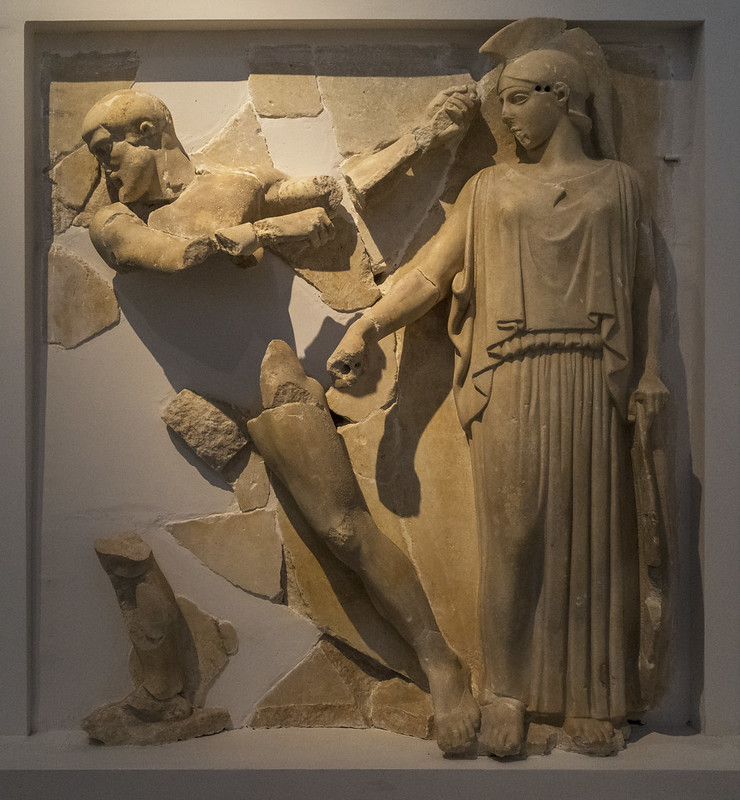

# Hyginus, chapter 30, sections 7-9

| | |
| --- | ---  | 
|  | `7` Augeae regis stercus bobile uno die purgauit, maiorem partem Ioue adiutore; flumine ammisso totum stercus abluit. |
|  | `8` taurum cum quo Pasiphae concubuit ex Creta insula Mycenis uiuum adduxit. |
|  | `9` Diomedem Thraciae regem et equos quattuor eius, qui carne humana uescebantur, cum Abdero famulo interfecit; equorum autem nomina Podargus Lampon Xanthus Dinus. | 

