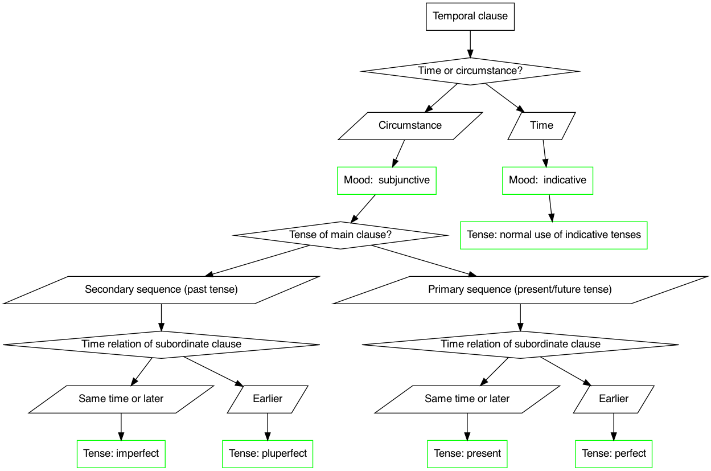

# Latin 102-04: home page

> In Latin 102, you encounter a historical language and culture, and engage with how that language and culture continue to shape structures of power today.

Zoom for [class meetings MWF 9:15-10:05](https://holycross.zoom.us/j/96104492045?pwd=eEtBL1FkUnJZcURCeE9ETmxtMk9lUT09)

## Announcements

- **Feb. 8**:  flow chart for determining tense and mood in temporal clauses 
- **Feb. 8**: If you have preferences for a topic in CBL lab projects, please notify Ainsley and Jack by Friday, Feb. 12.
- **Feb. 8**: Repeating Zoom links for CBL labs:
    - Monday 4:45 session: <https://holycross.zoom.us/j/94858327623>
    - Monday 6:00 session: <https://holycross.zoom.us/j/96285498309>
    - Tuesday 8:00 session: <https://holycross.zoom.us/j/97191045757>
- [earlier announcements](./oldnews/)
- [notes from breakout sessions](./breakouts/)

## This week in summary

- **Main language features**: Review: class assignments review common pronouns and continue to review verb forms and constructions. New: fifth declension nouns; future indicative tense.
- **Vocabulary**: learn (very short!) [week 2 vocabulary list](./vocabulary/week2/)
- **Exercises**: drill verb forms; drill pronouns.
- **Due dates this week**:  [translation 1](./checklist/translation1/) due Friday

